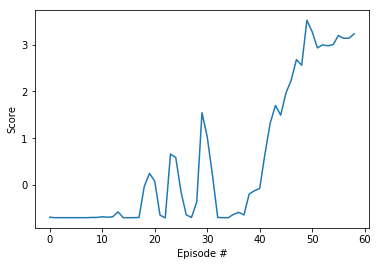

# Report
###  Learning Algorithm

This project uses DDPG algorithm to solve the problem. Two agents share the same replay buffer and actor and critic networks. 

In the beginning, the weights of primary randomly initialized, and the weights are assigned to target network. The replay buffer and Ornstein–Uhlenbeck process noise generator are also initialized.

In each step, action is generated according to the input states under current policy and exploration noise. Interact with the environment to get the reward and new state. Store the SARS tuple in the replay buffer.

Sample a minibatch of SARS tuple from buffer, update the critic network by minimizing the loss, and update the actor network using policy gradient. 

After 5 steps, update the target networks using the soft update formula and the weights from primary networks.

### Hyperparameters

For the above algorithm, the hyperparameters are:

- Replay memory buffer size R = 1000,000
- Minibatch size N = 512
- Discount factor Gamma = 0.99
- Maximum number of episodes M = 1000
- Soft update of target parameters factor TAU = 0.001
- Actor Learning rate = 0.0001
- Actor Learning rate = 0.0003
- L2 weight decay factor = 0.0001

###  Model Architectures

There are two neural networks in this model,  actor network and critic network.

The actor network consists of one hidden layer and one output layer. The hidden layer has input size of 24(size of state) and output size of 64, the output layer has input size of 64 and output size of 2(size of action). The hidden layer has relu function as its activation, and the output layer has hyperbolic tangent activation function.

The critic network consists of three hidden layers and one output layer. The first layer has input size of 24(size of state) and output size of 64, the second layer concatenate the output of first layer and the action vector, which has input size of 66(64+2) and output size of 64, the third layer has input size of 64 and output size of 64, the output layer has input size of 64 and output size of 1. The three hidden layers all have leaky relu function as their activations, and the output layer has linear activation function.

### Plot of Rewards

The agent took 59 steps to solve the problem(receive +0.5 average reward)

### Ideas for Future Work

- In this project each agent used the same actor network to select actions, and the experience was added to a shared replay buffer. Using MADDPG algorithm and use separate networks may yield in better results
- Try other algorithms such as Proximal Policy Optimization (PPO), Trust Region Policy Optimization (TRPO) and Truncated Natural Policy Gradient (TNPG), and Distributed Distributional Deterministic Policy Gradients (D4PG) in stead of DDPG to see whether they can yield better performance
